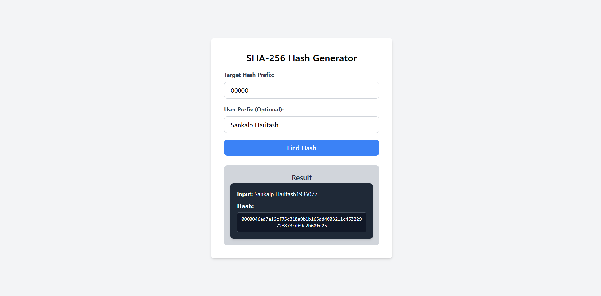
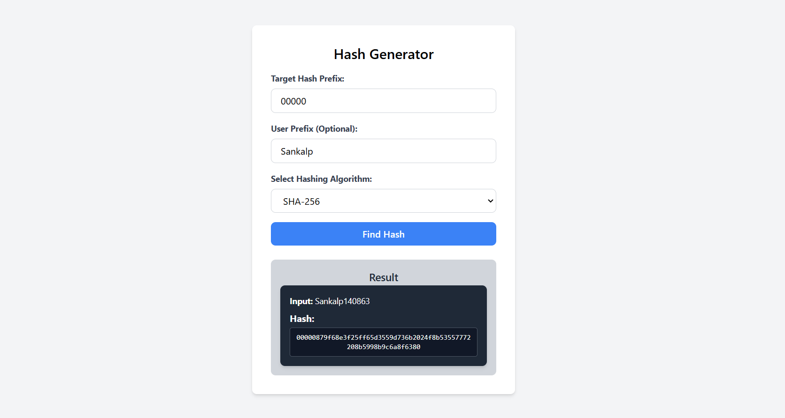

# Hashing Application

<div style="display: flex; justify-content: space-around;">
  <div style="text-align: center;">
    <h4>Old Version</h4>
    
  </div>
  <div style="text-align: center;">
    <h4>New Version</h4>
    
  </div>
</div>

# Overview

- The Hashing Application is a web-based tool that enables users to hash strings using various cryptographic algorithms.
- With a simple and intuitive interface, users can select their desired algorithm and see the resulting hash instantly. -This application is ideal for developers, security professionals, and anyone interested in understanding cryptographic hashing.

# Key Features

Multiple Hashing Algorithms: Choose from several cryptographic hashing algorithms, including:

- SHA-256
- SHA-1
- MD5
- SHA-512
- SHA3
- HMAC (SHA-256, SHA-512)

1. User-Friendly Interface: An easy-to-navigate interface that allows users to input strings and select algorithms seamlessly.

2. Real-Time Hash Generation: Instant feedback with real-time hash generation as users enter their input and select algorithms.

## Technologies Used

1. Frontend: Built using React for a responsive user interface.
2. CryptoJS: A JavaScript library providing cryptographic algorithms for hashing.

### Getting Started

To run the Hashing Application locally, follow these steps:

- Prerequisites
  Ensure you have Node.js installed on your machine.

- Installation
  Clone the repository:

```
git clone https://github.com/yourusername/hashing-application.git
```

```
cd hashing-application
```

- Install the required dependencies:

```
npm install
```

Start the application:

```
npm run dev
```

Open your browser and navigate to http://localhost:3000 to access the application.

### Usage

1. Input Field: Enter the string you want to hash in the provided input field.
2. Select Algorithm: Choose a hashing algorithm from the dropdown menu.
3. Generate Hash: Click the "Generate Hash" button to view the resulting hash.

## Contributing

Contributions are welcome! If you’d like to contribute to the project, please fork the repository and submit a pull request with your improvements or features.

### Acknowledgements

- CryptoJS for the cryptographic functions that power the hashing capabilities.
- React for providing a framework to build the user interface.
